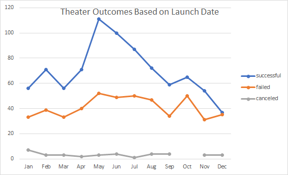
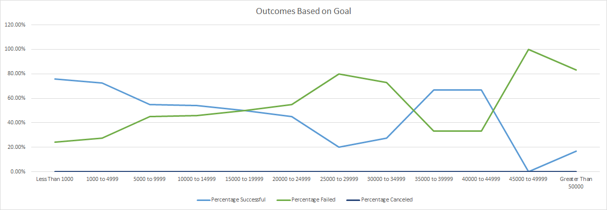

Kickstarter analysis was done to uncover trends of plays in relation to launch date and funding goals. All data was pulled from the kickstarter workbook was analyzed and visualized on excel.

Analysis was initially done on the workbook to find launch date trends for the category of theater. The three outcomes for theater are successful, failed, and canceled. The outcomes were then charted on a line graph to show if there is a difference in the success of theater productions that are launched throughout the year. 

Theater was then broken down into the subcategory plays. The plays were then broken into success, failed, and canceled based on their initial financial goals. This was structured as plays with goals less than $1000, $1000-$4999, and moved in $5000 increments until $50000. This was charted with the countif function from the workbork. 

The most challenging aspect of this analysis was using the countif feature, I was unable to digest the video guide and had to play with the formula for a long period of time. Another challenge is handling a large data set like this and not messing up the data.

The results of the data show that successful theater productions are more likely to be launched in May and productions appear to have more success when launched in the summer months (May.-Aug.). Diving further, plays are most likely to succeed with a goal under $5000. The graph shows that plays with goals between $35000 and $45000 see success, but there was only 3 units of data. We can conclude that the best time to launch a play is in the summer with a goal of under $5000. 
